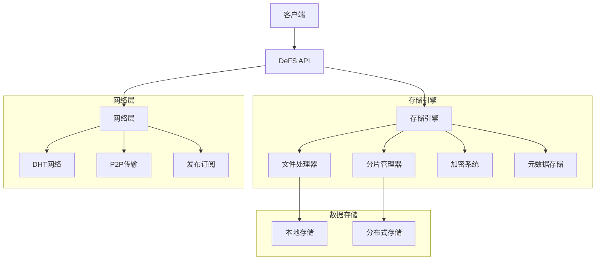
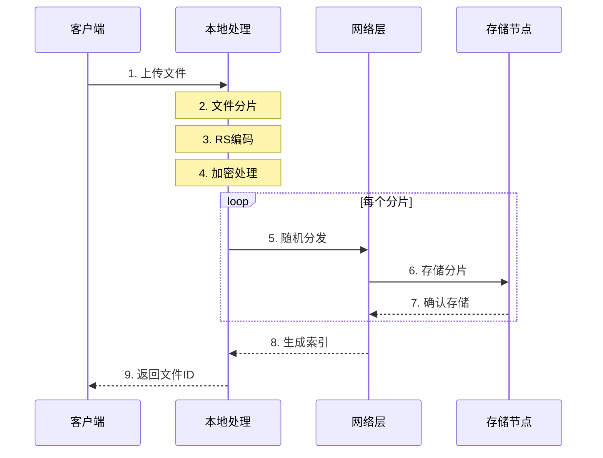
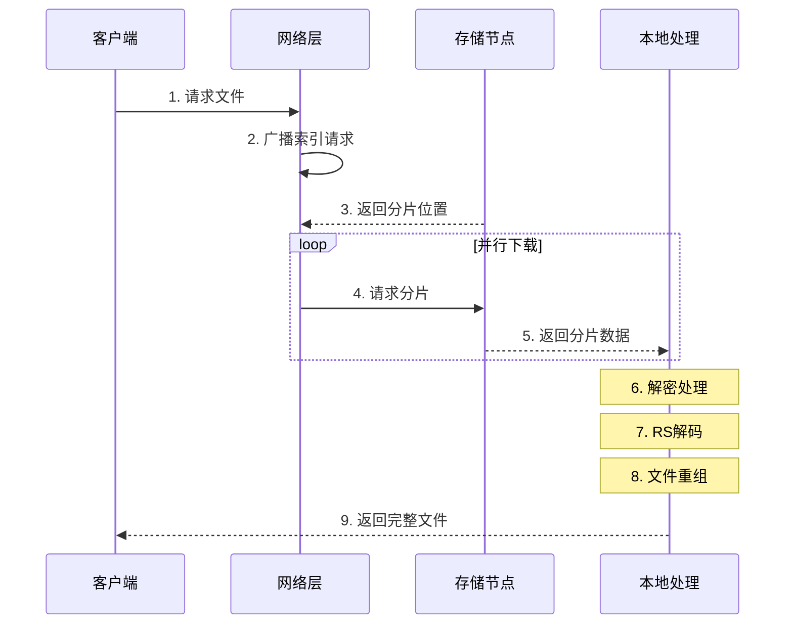
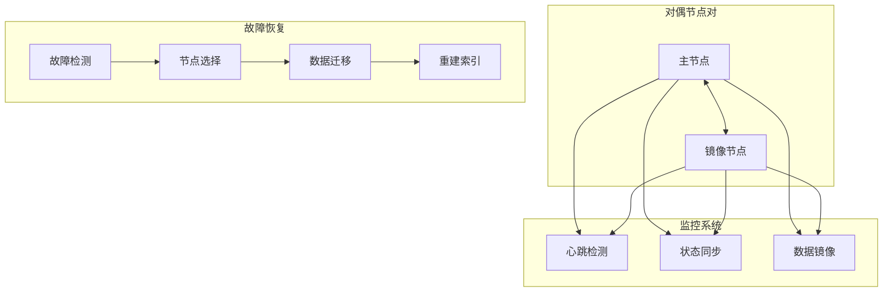
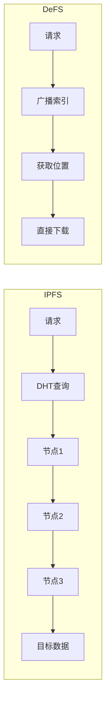

# DeFS - 去中心化动态存储系统

[](https://pkg.go.dev/github.com/bpfs/defs) []() [](LICENSE)

DeFS (Decentralized File Service) 是一个基于 P2P 网络的去中心化文件存储系统。它通过动态存储技术和智能分片策略,为用户提供高效、安全、可靠的分布式存储服务。

## 系统架构



## 核心流程

### 文件上传流程



### 文件下载流程



### 对偶节点机制



### 存储寻址对比



## 技术创新

### 分布式架构
- **去中心化网络**
  - 基于 Kademlia DHT 的分布式网络架构
  - 无中心节点的纯 P2P 设计
  - 支持节点自由加入和退出
  - 高效的节点发现和路由机制

- **动态存储技术**
  - 自适应的多模式存储策略
  - 基于负载的动态分片调度
  - 智能的数据分布算法
  - 弹性的资源分配机制

### 数据处理
- **智能分片技术**
  - 文件/切片/RS编码三种模式
  - 自适应的分片大小调整
  - 基于文件特征的模式选择
  - 优化的分片存储策略

- **纠删码技术**
  - Reed-Solomon 编码实现
  - 可配置的数据和校验分片比例
  - 支持部分分片丢失恢复
  - 兼顾可靠性和存储效率

### 网络传输
- **P2P 通信**
  - 基于 libp2p 的传输层
  - 多路复用的连接管理
  - NAT 穿透和中继支持
  - 流量控制和拥塞处理

- **任务调度**
  - 多 worker 并行传输
  - 基于优先级的任务队列
  - 智能的任务分配策略
  - 细粒度的进度控制

### 安全机制
- **身份认证**
  - ECDSA 非对称加密
  - P2PKH/P2PK 脚本系统
  - 基于公钥的身份标识
  - 防篡改的签名验证

- **数据安全**
  - 端到端加密传输
  - AES-GCM 加密存储
  - CRC32 完整性校验
  - 细粒度的访问控制

## 核心创新

### 创新的存储寻址机制

#### 传统内容寻址的局限
- **可预测性**: 基于内容哈希的寻址方式使得数据位置可被计算和预测
- **多跳路由**: 需要通过多个节点跳转才能定位到目标数据
- **性能开销**: 每次跳转都增加额外的网络延迟
- **隐私风险**: 数据分布可被追踪和监控

#### DeFS 的随机分布式存储
- **本地加密分片**
  - 文件在本地完成分片和加密
  - 每个分片使用独立的密钥
  - 采用门限密钥共享方案
  - 确保数据安全性和私密性

- **离散化随机存储**
  - 分片随机分布到网络中
  - 无法预测或追踪数据位置
  - 提高数据安全性和隐私性
  - 避免数据分布的可计算性

#### 创新的数据检索机制
- **广播式索引获取**
  - 无需多跳 DHT 查询
  - 直接广播获取索引清单
  - 类似 BT 种子的方式
  - 显著提升检索效率

- **点对点直接传输**
  - 获得索引后直接连接
  - 避免多次节点跳转
  - 优化传输路径
  - 提高下载速度

### 对偶节点存储架构

#### 双节点备份机制
- **对偶节点配对**
  - 数据在对偶节点间镜像
  - 实时心跳检测
  - 状态互相监控
  - 自动故障恢复

- **故障恢复流程**
  - 单节点故障: 新节点选择 -> 数据迁移 -> 关系重建
  - 双节点故障: 纠删码恢复 -> 选择新对偶对 -> 重建数据 -> 更新索引

#### 智能节点匹配
- **多维度评分系统**
  - 地理位置分布
  - 带宽和存储容量
  - 网络延迟
  - 节点稳定性

- **动态优化策略**
  - 实时性能评估
  - 负载均衡考虑
  - 地理分布优化
  - 最优对偶匹配

### 性能对比分析

#### 传输效率
| 特性 | 传统 IPFS | DeFS |
|------|-----------|------|
| 寻址方式 | 内容寻址(多跳) | 广播索引(直达) |
| 查询步骤 | 3-5 次跳转 | 1 次广播 |
| 传输路径 | 间接传输 | 直接点对点 |
| 平均延迟 | 较高 | 显著降低 |

#### 数据可靠性
| 保护机制 | 传统方案 | DeFS |
|----------|----------|------|
| 备份策略 | 单一副本 | 对偶节点 + 纠删码 |
| 故障恢复 | 被动复制 | 主动检测和恢复 |
| 数据一致性 | 最终一致 | 实时同步 |
| 恢复速度 | 较慢 | 快速 |

### 技术优势总结

1. **隐私保护**
   - 本地加密和分片
   - 随机分布存储
   - 无法追踪数据位置
   - 密钥安全共享

2. **检索效率**
   - 广播式索引获取
   - 直接点对点传输
   - 避免多跳延迟
   - 优化传输路径

3. **可靠性保障**
   - 对偶节点备份
   - 纠删码保护
   - 主动故障检测
   - 快速故障恢复

4. **系统扩展性**
   - 动态节点管理
   - 智能负载均衡
   - 灵活配置调整
   - 高效资源利用

## 快速开始

### 安装

需要 Go 1.20 或更高版本。

```bash
go get github.com/bpfs/defs
```

### 基础示例

```go
import (
    "github.com/bpfs/defs"
    "github.com/bpfs/defs/fscfg"
)

// 创建配置选项
opts := &fscfg.Options{
    StorageMode:    fscfg.FileMode,      // 存储模式
    DataShards:     10,                  // 数据分片数
    ParityShards:   4,                   // 校验分片数
    MaxSliceSize:   64 * 1024 * 1024,    // 最大分片大小
    MinSliceSize:   1 * 1024 * 1024,     // 最小分片大小
    ShardSize:      32 * 1024 * 1024,    // 分片大小
}

// 创建 DeFS 实例
fs, err := defs.New(opts)
if err != nil {
    panic(err)
}

// 上传文件
taskID, err := fs.Upload("/path/to/file")
if err != nil {
    panic(err)
}

// 下载文件
err = fs.Download(fileID, "/save/to/path")
if err != nil {
    panic(err)
}
```

更多示例请参考 [examples](examples/README.md)。

## 配置选项

### 存储模式
- **FileMode**: 适用于小文件存储
- **SliceMode**: 用于大文件分片存储
- **RS_Size**: 基于大小的 RS 编码模式
- **RS_Proportion**: 基于比例的 RS 编码模式

### 网络设置
- **Port**: 节点监听端口
- **Bootstrap**: 是否作为引导节点
- **MaxConnections**: 最大连接数
- **DialTimeout**: 连接超时时间

### 存储配置
- **DataShards**: RS 编码数据分片数(1-100)
- **ParityShards**: RS 编码校验分片数(1-100)
- **MaxSliceSize**: 最大分片大小(默认 64MB)
- **MinSliceSize**: 最小分片大小(默认 1MB)
- **ShardSize**: 标准分片大小(默认 32MB)

### 系统配置
- **DataDir**: 数据存储目录
- **LogDir**: 日志存储目录
- **WorkerNum**: Worker 数量
- **BufferSize**: 缓冲区大小

## 技术架构

```
defs/
├── afero/        # 文件系统抽象层
├── crypto/       # 加密与安全
├── database/     # 元数据存储(BadgerDB/SQLite)
├── downloads/    # 下载管理
├── files/        # 文件处理
├── fscfg/        # 配置管理
├── kbucket/      # DHT路由表
├── net/          # P2P网络(基于 libp2p)
├── pb/           # Protocol Buffers定义
└── uploads/      # 上传管理
```

## 开发状态

当前处于 Alpha 阶段,已完成功能:
- [x] 基础文件上传/下载
- [x] DHT 节点发现
- [x] 数据分片存储
- [x] Reed-Solomon 编码
- [x] 加密传输
- [x] 任务管理
- [ ] 数据迁移(开发中)
- [ ] 负载均衡(开发中)
- [ ] 存储优化(规划中)

## 依赖说明

主要依赖:
- github.com/dep2p/go-dep2p: P2P 网络框架
- github.com/dep2p/kaddht: Kademlia DHT 实现
- github.com/dep2p/pubsub: 发布订阅系统
- github.com/dgraph-io/badger/v4: 键值存储
- github.com/mattn/go-sqlite3: SQLite 支持

## 参与贡献

欢迎参与项目开发,您可以:
- 提交 Issue 报告问题
- 提交 PR 改进代码
- 完善项目文档
- 分享使用经验

参考[贡献指南](CONTRIBUTING.md)了解详情。

## 相关资源

- [API 文档](https://pkg.go.dev/github.com/bpfs/defs)
- [示例程序](examples/)
- [性能测试](benchmarks/)

## 开源协议

本项目采用 [MIT](LICENSE) 协议。
